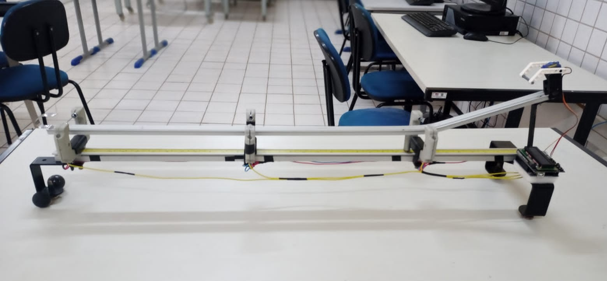
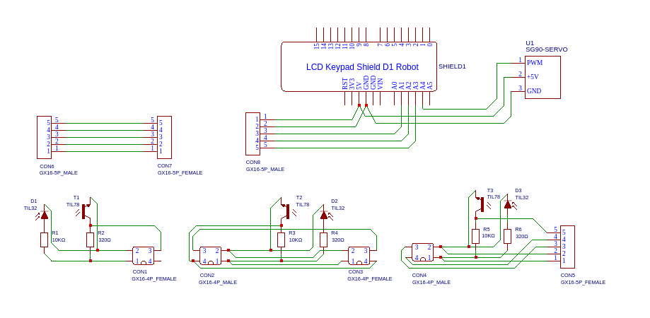

# AEMF-01

AEMF-01: Equipamento Laboratorial para Estudos sobre Movimento na Física

> Imagem de uma das primeiras versões do projeto, feita em alumínio

<p align=left></p>

## Sobre

O AEMF-01 é um projeto de equipamento laboratorial de código aberto desenvolvido para a exploração e compreensão dos princípios do movimento na física. Inicialmente feito em alumínio, plástico e metal, a versão final disponibilizada ao público foi completamente reprojetada e modelada para a impressão 3D. Essa evolução não apenas otimiza a durabilidade do equipamento, mas também simplifica significativamente o processo de construção, tornando-o mais compacto e facilitando a reprodução por entusiastas e educadores.

## Características

- Display com botões para visualização e interação com o Software
- Três sensores que podem ser posicionados ao longo do trilho possibilitando uma gama de configurações e experimentos
- Exibição dos valores via LCD ou comunicação Serial
- Todo o projeto foi adaptado para a impressão 3D, facilitando a montagem e reprodução.

## Estrutura das pastas

```
ÀEMF-01
├── docs -- 
│  ├── components -- 
│  └── models -- 
│     ├── base -- 
│     ├── case -- 
│     ├── rail -- 
│     │  ├── base -- 
│     │  └── support -- 
│     └── sensor -- 
│        ├── cabinet -- 
│        └── support -- 
├── include -- 
├── lib -- 
└── test -- 
```

---

## Hardware

### Especificações

### Diagrama elétrico

Abaixo está uma imagem do diagrama elétrico do projeto caso você queira visualizar mais
informações, editar ou abrir o projeto em sua máquina pode baixar o diagrama que [está aqui](./docs/easyeda_project.zip)
e abrir utilizando o [EasyEDA](https://easyeda.com/)

<p align=left></p>

### Componentes

A tabela abaixo contem especificacoes sobre os componentes que são exibidos no [diagrama eletrico](#diagrama-elétrico).<br>
Na coluna **Docs** está listado os documentos tecnicos com mais informacoes sobre cada componente

| Item | Quantidade | Identificador | Docs |
| :--- | :--- | :--- | :--- |
| Arduino UNO R3 | 1 | | [Datasheet](./docs/components/A000066_datasheet.pdf), [Pinagem](./docs/components/A000066_pinout.png) |
| 1602 LCD Keypad Shield | 1 | SHIELD1 | [Datasheet](./docs/components/DFR0009_datasheet.pdf), [Esquema](./docs/components/DFR0009_schematic.pdf), [Wiki](https://wiki.dfrobot.com/LCD_KeyPad_Shield_For_Arduino_SKU__DFR0009) |
| GX16-4P | 2 | CON1, CON2, CON3, CON4 | [Datasheet](./docs/components/KH-GX16-4P_datasheet.pdf) |
| GX16-5P | 2 | CON5, CON6, CON7, CON8 | [Datasheet](./docs/components/KH-GX16-5P_datasheet.pdf) |
| TIL32 940nm 5mm | 3 | D1, D2, D3 | [Datasheet](./docs/components/TIL78-TIL32_datasheet.pdf) |
| TIL78 940nm 5mm | 3 | T1, T2, T3 | [Datasheet](./docs/components/TIL78-TIL32_datasheet.pdf) |
| CR25 1/4 5% 10KΩ | 3 | R1, R3, R5 | [Datasheet](./docs/components/CRSERIES_datasheet.pdf) |
| CR25 1/4 5% 320Ω | 3 | R2, R4, R6 | [Datasheet](./docs/components/CRSERIES_datasheet.pdf) |
| SG90 Servo | 1 | U1 | [Datasheet](./docs/components/SG90_datasheet.pdf) |


---

## Montagem

### Materiais

| Item | Quantidade | Docs | Propriedades | Cores |
| :--- | :--- | :--- | :--- | :--- |
| Arduino UNO R3 | 1 | [Datasheet](./docs/components/A000066_datasheet.pdf), [Pinagem](./docs/components/A000066_pinout.png) | | |
| 1602 LCD Keypad Shield | 1 | [Datasheet](./docs/components/DFR0009_datasheet.pdf), [Esquema](./docs/components/DFR0009_schematic.pdf), [Wiki](https://wiki.dfrobot.com/LCD_KeyPad_Shield_For_Arduino_SKU__DFR0009) | Rev 1.0 | |
| GX16-4P | 2 | [Datasheet](./docs/components/KH-GX16-4P_datasheet.pdf) | 4 Pinos | |
| GX16-5P | 2 | [Datasheet](./docs/components/KH-GX16-5P_datasheet.pdf) | 5 Pinos | |
| TIL32 940nm 5mm | 3 | [Datasheet](./docs/components/TIL78-TIL32_datasheet.pdf) | Emissor | Cristal |
| TIL78 940nm 5mm | 3 | [Datasheet](./docs/components/TIL78-TIL32_datasheet.pdf) | Receptor | Preto |
| CR25 1/4 5% 10KΩ | 3 | [Datasheet](./docs/components/CRSERIES_datasheet.pdf) | | |
| CR25 1/4 5% 320Ω | 3 | [Datasheet](./docs/components/CRSERIES_datasheet.pdf) | | |
| SG90 Servo | 1 | [Datasheet](./docs/components/SG90_datasheet.pdf) | | |
| Cabos | 1 | [Datasheet](./docs/components/cables_fritzing_diagram.png) | 4,5m, 2.0mm | Vermelho, Azul, Verde, Amarelo, Branco, Preto |


### Procedimento de montagem
### Compilação, checagem e envio com o PlatformIO

---

## Utilização

### Utilização e navegação por meio dos Menus
### Configuração
  - Posicionamento e calibracação dos sensores

---

## Contribuição

---

## Licensiamento

GNU General Public License v3.0 ou posterior

Consulte [COPYING](./COPYING) para ver o texto completo.

---

## Referências

- [Arduino & Ensino de Física por Oséias Mourão](https://ifce.edu.br/sobral/campus-sobral/cursos/posgraduacoes/mestrado-1/mnpef/arquivos/5-produto-educacional-arduino-e-o-ensno-de-fisica.pdf).
- [Deej - an **open-source hardware volume mixer**](https://github.com/omriharel/deej)
