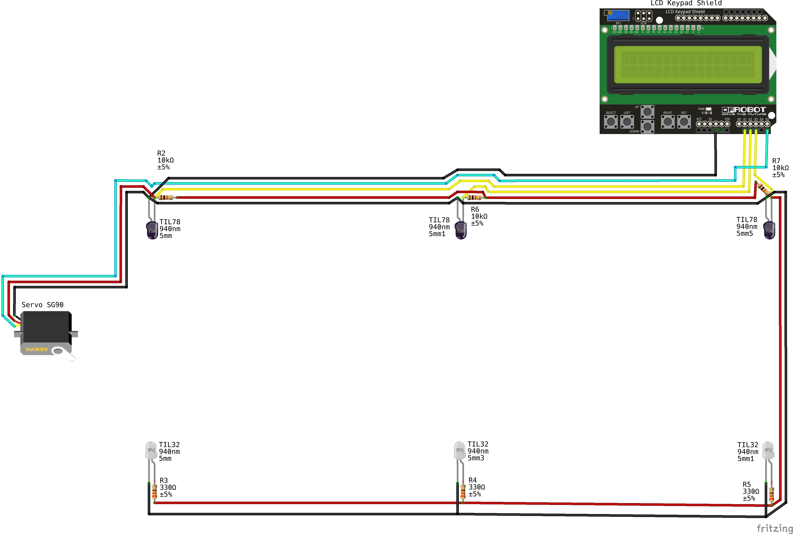

# ⚛️ Average Motion Speed Meter
A speed meter for kinematics studies.

[:brazil: Portuguese](./../README.md)

---

## About
The AMS Meter was developed as a project for display at the [Feira de Ciências: Sustentabilidade e Inovação - 2022](https://www.educacao.ma.gov.br/feira-de-ciencias-sustentabilidade-e-inovacao/).
The project focuses on the use of robotics and its technologies to assist in the study of physics,
particularly in the field of kinematics. In this project, we will explore the use of the Arduino
platform and programming to create tools for studying uniform motion.

---

## Circuit Diagram
Below is an illustration of the project's circuit diagram. You can open the electrical diagram in [Fritzing](https://fritzing.org/download/) by downloading the [project here](./assets/Fritzing_Diagram.fzz).



---

## Components
| Name | Model | Quantity | Propertie | Datasheet | Schematic |
| ---- | ----- | -------- | ---------- | --------- | --------- |
| Linear Motion Rail | - | 1 | Length: 93cm |
| Arduino UNO | REV3 | 1 | - |
| IR Receiver LED | TIL78 | 3 | Black; 5mm; 940nm | [Here](./datasheets/TIL78_Datasheet.pdf) |  |
| IR Emitter LED | TIL32 | 3 | White; 5mm; 940nm | [Here](./datasheets/TIL32_Datasheet.pdf) |  |
| LCD Keypad Shield | 1902 | 1 | Older version | [Here](./datasheets/1902_LCD_Keypad_Shield_Datasheet.pdf) | [Here](./datasheets/DFR0009_LCD_KeyPad_Shield_Schematic.pdf) |
| 330Ω 1/4W Resistor | CR25 | 3 | - |
| 10KΩ 1/4W Resistor | CR25 | 3 | - |
| Servo Motor | 9G SG90  | 1 | - | [Here](./datasheets/Micro_Servo_9G_SG90_Datasheet.pdf) |  |
| Cables | Flexible | 1 | 0.5mm; Green, Yellow, Black,<br>Red, White, Blue |
| 170 Protoboard | MB-830 | 1 | - |

---

## Copyright, License and Credits

[MIT License](./LICENSE)

```
Copyright (c) 2023 Abiel (Paodelonga) Mendes.

Permission is hereby granted, free of charge, to any person obtaining a copy
of this software and associated documentation files (the "Software"), to deal
in the Software without restriction, including without limitation the rights
to use, copy, modify, merge, publish, distribute, sublicense, and/or sell
copies of the Software, and to permit persons to whom the Software is
furnished to do so, subject to the following conditions:

The above copyright notice and this permission notice shall be included in all
copies or substantial portions of the Software.

THE SOFTWARE IS PROVIDED "AS IS", WITHOUT WARRANTY OF ANY KIND, EXPRESS OR
IMPLIED, INCLUDING BUT NOT LIMITED TO THE WARRANTIES OF MERCHANTABILITY,
FITNESS FOR A PARTICULAR PURPOSE AND NONINFRINGEMENT. IN NO EVENT SHALL THE
AUTHORS OR COPYRIGHT HOLDERS BE LIABLE FOR ANY CLAIM, DAMAGES OR OTHER
LIABILITY, WHETHER IN AN ACTION OF CONTRACT, TORT OR OTHERWISE, ARISING FROM,
OUT OF OR IN CONNECTION WITH THE SOFTWARE OR THE USE OR OTHER DEALINGS IN THE
SOFTWARE.
```

The project was based on examples taken from the book [_Arduino & Ensino de Física por Oséias Mourão_](https://ifce.edu.br/sobral/campus-sobral/cursos/posgraduacoes/mestrado-1/mnpef/arquivos/5-produto-educacional-arduino-e-o-ensno-de-fisica.pdf).
